# Sample Ionic Login Application with Mobile Foundation

## Assumptions

This tutorial was created on a Mac, your milage may vary. The following tools are used to complete this tutorial:

* [Node.js](https://nodejs.org/en/) version 6.9.5, however any version of Node.js 6 should work
* [Cordova](https://www.npmjs.com/package/cordova) version 7.0.1
* [Ionic](https://www.npmjs.com/package/ionic) version 3.7.0
* [Mobile Foundation Command Line Interface](https://www.npmjs.com/package/mfpdev-cli) version 8.0.0-2017012016
* [Mobile Foundation Developer Kit](http://mobilefirstplatform.ibmcloud.com/downloads/) version 8.0.0.00-20170707-135724
* [Visual Studio Code](https://code.visualstudio.com/) Version 1.14. You may use another IDE of your choice such as WebStorm, Atom, etc.
* [Google Chrome](https://www.google.com/chrome/browser/desktop/index.html) 59.0.3071.115
* [Xcode Version 8.3.3 (8E3004b)](https://developer.apple.com/xcode/downloads/) Requires an [Apple Developer Account](https://developer.apple.com/support/membership/)
* [Android Studio 2.3.3](https://developer.android.com/studio/index.html)

## Tutorial Steps

1. Setup
1. Create User Authentication Adapter
1. Create Ionic Login Application
1. Build and register the application
1. Test using iOS
1. Test using Android

> **NOTE:** All source files are stored in the scripts directory. 
> 
> * [app.component.ts](scripts/app.component.ts.txt)
> * [custom.typings.d.ts](scripts/custom.typings.d.ts.txt)
> * [login.html](scripts/login.html.txt)
> * [login.scss](scripts/login.scss.txt)
> * [login.ts](scripts/login.ts.txt)

This tutorial assumes that you have installed and started your local version of the Mobile Foundation Server. You can also use a Bluemix instance of Mobile Foundation Server, however the examples in this tutorial use the server found in the Developer Kit. Follow the link above to download the Developer Kit and for instructions on installing.

To start your server on Mac, assuming you installed the server in the default location, change directories to the server directory:

```
cd ~/MobileFirst-8.0.0.0
```

To start the server use the `run.sh` command. This will start the server, however if you close the terminal session the server will be closed (killed). The server will also be stopped if you exit by typing `ctrl+c`.

```
./run.sh
```

To start the server such that if the terminal is closed, the server continues to run use the [`nohup`](https://developer.apple.com/legacy/library/documentation/Darwin/Reference/ManPages/man1/nohup.1.html) command. For example:

```
nohop ./run.sh &
```

This starts the nohup process with a no-hangup option. Server output is streamed to [`nohup.out`](https://developer.apple.com/legacy/library/documentation/Darwin/Reference/ManPages/man1/tail.1.html). You can now safely `ctrl+c` out of the process and the server will continue to run.

To continously view this file, use the `tail` command

```
tail -f nohup.out
```

## Setup
1. Open a terminal window and start your Mobile Foundation Server that comes with the Mobile Foundation Developer Kit. From the directory where Mobile Foundation Developer Kit was installed type:

	`nohup ./run.sh &`
	
	cmd+C
	
	`tail -f nohup.out`
	
	> **Note:** What the `nohup` command is doing is starting the Mobile Foundation Server as a background process. The `tail` command is reading the output generated as the server starts up.

1. Open a new terminal window or tab (you should have two windows or tabs open in your terminal) and create a project directory under your user directory and change directory to that newly created directory.

	`cd ~/`

	`mkdir Projects`
	
	`cd Projects`
	
	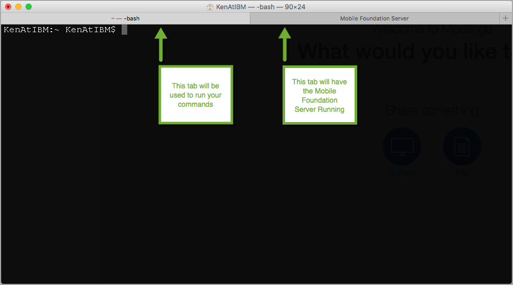

	> **Note:** If you already have a dirctory you can ignore this step and simple change to that directory.
	
1. Create a directory to store your project assets. This will include both the adapter and the Ionic application and change directory to that newly created directory.

	`mkdir UserLoginProject`

	`cd UserLoginProject`
	
## Create User Authentication Adpater
This is a bit misleading as you will download a sample adapter that already provides basic login capabilities. The adapter will authenticate the user based on the username and password being the same, for example if the username is `bob` then the password will be `bob`.	

1. Open the Mobile Foundation Operations Console

	`mfpdev server console`
	
	> **Note:** The Operations Console will be started using your default system browser. However if you would like to use one browser for your day to day browsing needs and a different browser for Mobile Foundation, you can. Use the `mfpdev config` command and select the `Development Broswer` option, then select `New Web Broswer` and enter the path to the browser that you want to use with `mfpdev`.
	
1. **Click** the Download Center link on the left side of the pageÍ

	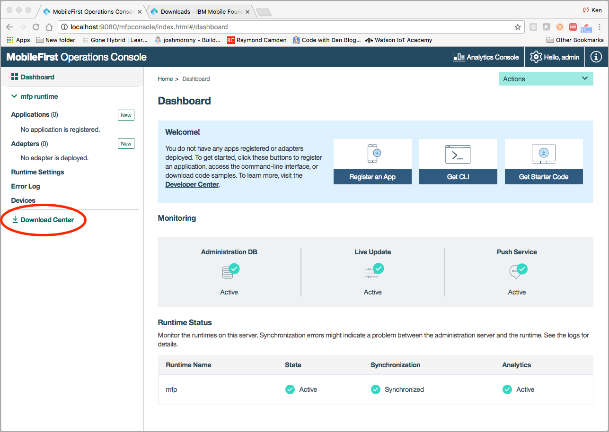
	
1. **Click** the Samples link on the Download Center page

	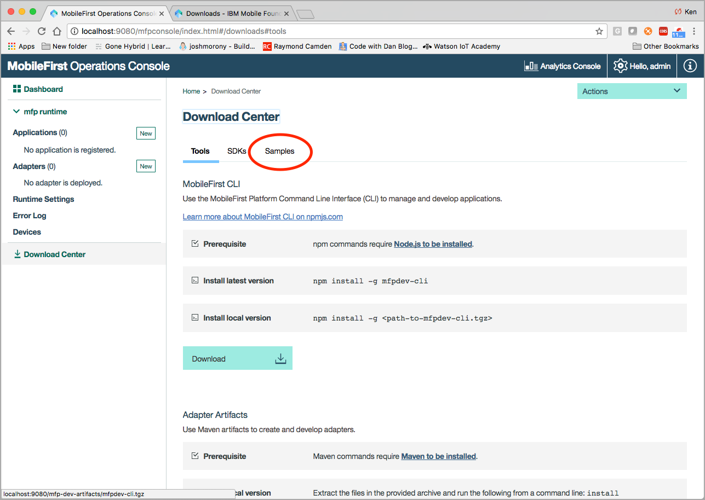
	
1. **Scroll** to the button of the page. You will see a section called Security Check Samples. There will be two options for User Authentication. The one on the left will download the sample from your server and is used in situations were you do not have internet connectivity. The one on the right will download the sample from a git repository, this version will be guaranteed to be the latest version of the sample although it will require that you have internet access. **Right Mouse Click** and select **Save Link As ...**

	
	
1. When the **Save As** dialog opens. Navigate to your `Projects/UserLoginProject` directory and **Click** the **Save** button.

	
	
1. When the download is complete you will need to expand the zip file in your directory. With Chrome this is very easy, simply **Click** the item in the bottom of your browser that contains ths UserLogin.zip file.

	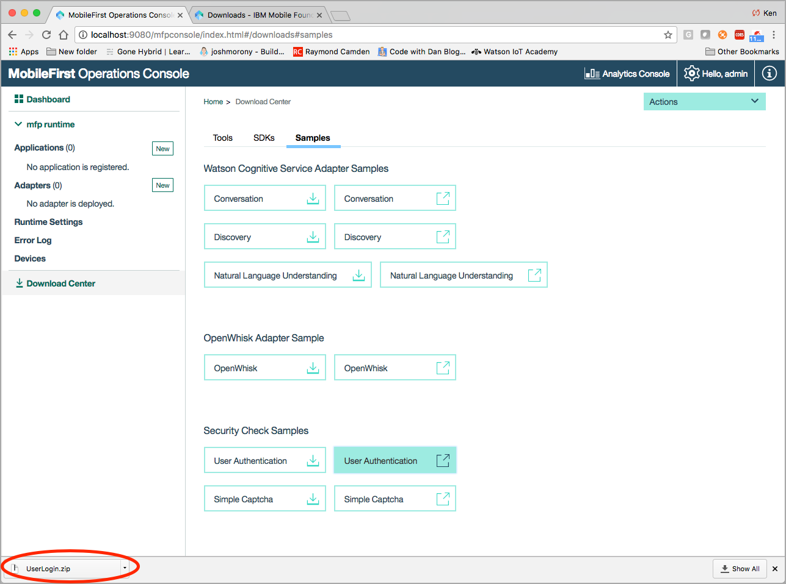

1. This will open up Finder, if on a Mac, and display the UserLogin directory.  

	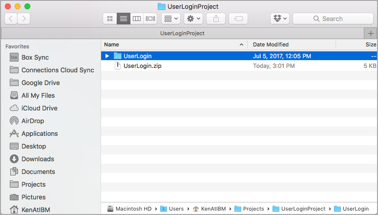

	> **Note:** You can delete the UserLogin.zip file if you like, but it is not necessary.
	
1. Start Visual Studio Code and **Open** the UserLoginProject directory.

	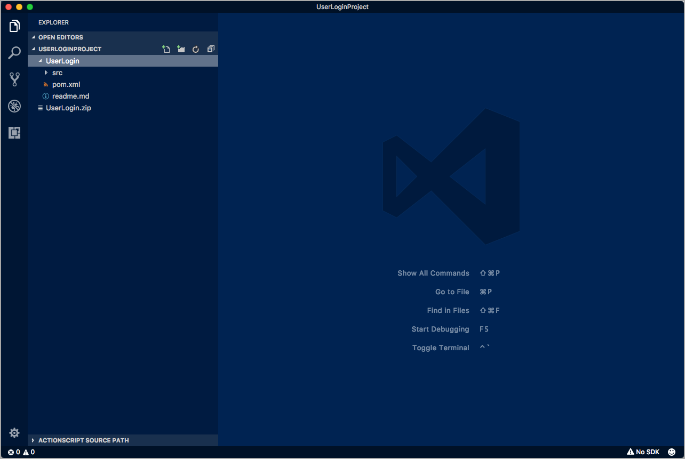

1. **IMPORTANT:** there is a bug in the current samples that has a dependency on a newer version of the adpater-maven-api. to fix this you will need to change the version of this denpendcy found in the pom.xml file.  **Open** the `pom.xml` file and locate the dependency called `adapter-maven-api`. Note that the version is `8.0.2017070400`, this is wrong and will cause the build to fail.

	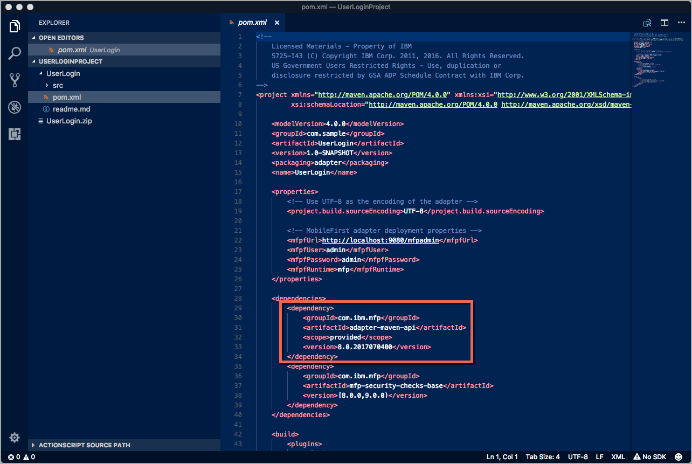
	
1. Change the version from `8.0.2017070400` to `8.0.2017021701` and save the file.

	
	
	> **Note:** This should be fixed in the future whereby the dependency is available on Maven.

1. Once that fix is in, build and deploy the adapter to the server. Go to your terminal window and type the following commands:

	First make sure you are in your adapter directory
	`cd ~/Projects/UserLoginProject/UserLogin`
	
	then execute the build command

	`mfpdev adapter build`
	
	once the completes successfully, execute the deploy command
	
	`mfpdev adapter deploy`
	
	
	
1. Ensure that your adapter is deployed by refreshing your Operations Console in the browser.
	
	

	> **Note:** You may need to re-login to the Operations Console. Or if you previously closed your Operations Console, you may need to reopen it by issuing a `mfpdev server console` command from your terminal.
	
## Create Ionic Login Application

1. Change directory back to your UserLoginProject directory.

	`cd ~/Projects/UserLoginProject`
	
1. Create a blank Ionic project

	`ionic start UserLoginApp`
	
	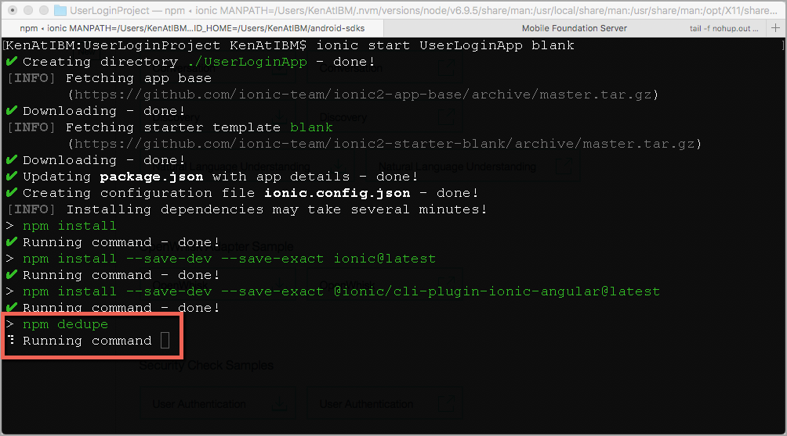
	
	> **Note:** You may run into a situation where the process hangs when running the comman `npm dedupe`. If you let it run, you will see a message like:	
	```
	Running command - failed!
	[WARN] Error while deduping npm dependencies. Attempting to continue...
	```

 	> I have logged a bug with the Ionic team. This appears to only happen with version 3.6.0 and not 3.5.0.  However if after some time your `ionic start` does not complete, you can simply `ctrl+c` to end. 

1. To verify that the application was created, change directory to `UserLoginApp` and type:

	`ionic serve`
	
	A browser window should open and display the following:
	
	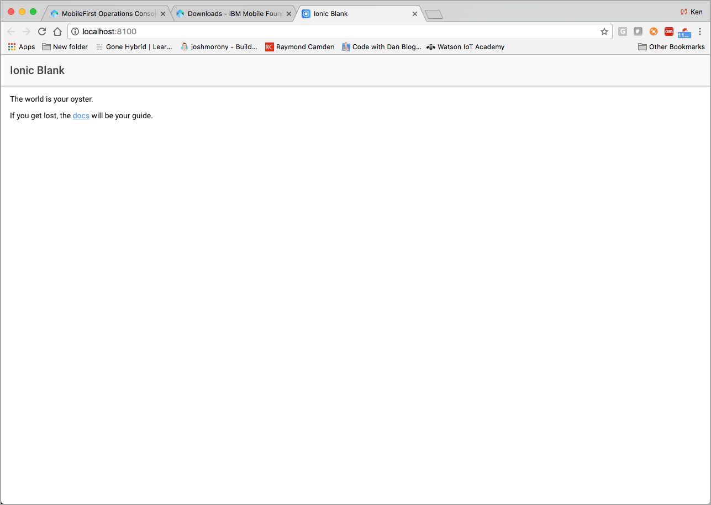
	
1. Close your browser tab with the Ionic app. Return to your terminal and exit ionic serve session by pressing the `ctrl` + `c` keys.
	
1.  Go back to Visual Studio Code. You should now see a new directory called `UserLoginApp`. This is the directory that was created by the `ionic start` command. Expand the directory and notice that it should be similar to the following:

	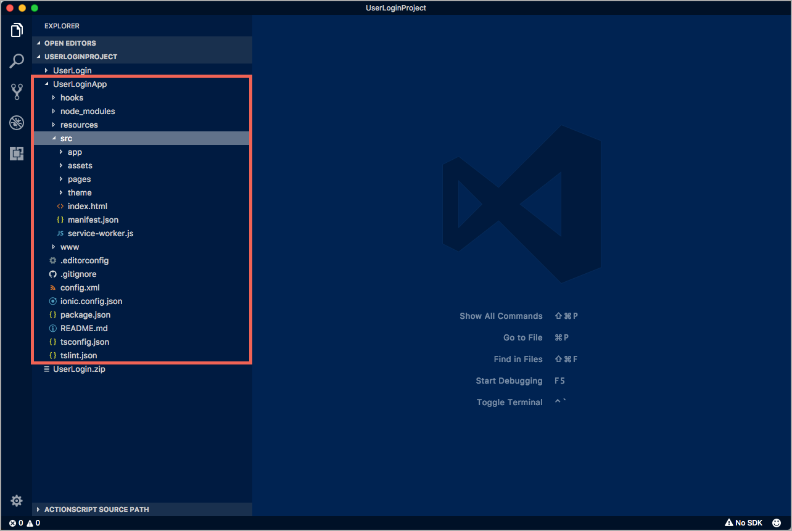
	
	What this directory contains is the following
	
	The `hooks` directory contains hook files. Cordova hooks are specialized commands that are used in the build process of your application. Click [here](https://cordova.apache.org/docs/en/latest/guide/appdev/hooks/) for more information on Cordova hooks.
	
	The `node_modules` directory is were all the node modules that are required to build and run your application reside. These dependencies can be found in the package.json file. Typically this directory should not be checked into your source code management solution. Include this directory in your .gitIgnore file.
	
	The `resources` directory is where the application icons, splash screen images, etc. are stored. Default images are stored in this directory for both ios and android.
	
	The `src` directory is where ionic stores the application source code. When building an application the source is transpiled from ECMAScript 6 to ECMAScript 5. For a discussion on transpiling in Angular, the underlying framework for Ionic, visit [here](https://angular.io/guide/ts-to-js). Most of your time will be spent in this directory.
	
	The `www` directory is the result of a build of the application. This is the ECMAScript 5 version of the application that later gets incorporated into the platform you are building for.
	
	The `.editorconfig` file helps developers define and maintain consistent coding styles between different editors and IDEs. For more information on this file visit [here](http://editorconfig.org)
	
	The `.gitignore` file is where the files and directories that git should ignore when pushing code to the repository reside.
	
	A `config.xml` file that provides your application properties for Cordova. Click [here](https://cordova.apache.org/docs/en/latest/config_ref/) for more information on the config.xml file.
	
	The `ionic.config.json` file provides application properties for Ionic.
	
	The `package.json` file provides a list of dependencies, among other things, for building your application. This allows for a cloned project from github to have all its dependencies downloaded by issuing an `npm install` command.
	
	The `README.md` is a Markdown file that you can use to describe your project when uploading to GitHub - super nice feature.
	
	The `tsconfig.json` file is a TypeScript configuration file. For more information on this file visit [here](https://www.typescriptlang.org/docs/handbook/tsconfig-json.html)
	
	The `tslint.json` file is used to determine which rules get run against the applications TypeScript. For more information on this file visit [here](https://palantir.github.io/tslint/).
	
1. The first thing that needs to be added to the project are the cordova platforms that the application will be built for. In this case iOS and Android. To do that open a terminal window, if not already open. Change directory to your UserLoginApp directory:

	`cd ~/Projects/UserLoginProject/UserLoginApp`
	
	Next add the iOS platform (if on a Macintosh). 	
	`ionic cordova platform add ios`
	
	You may get asked the following question:
	
	`? The plugin @ionic/cli-plugin-cordova is not installed. Would you like to install it and 
continue? (Y/n)`

	Enter `Y` and press the enter/return key.

	Next add the Android platform.
	
	`ionic cordova platform add android`

	> **NOTE:** If you are on a non-Macintosh machine there is no reason to install the iOS platform.

1. Next add the Mobile Foundation Cordova Plugin.

	`ionic cordova plugin add cordova-plugin-mfp`
	
	> **NOTE:** This will add the basic Mobile Foundation SDK. Other plugins install support for JSON, Push, LiveUpdate, FIPS, & Encryption.

1. Next the compiler needs to be given a hint as to were the SDK for Mobile Foundation resides.  Go back to Visual Studio Code. Create a file called `custom.typings.d.ts` in the `src` directory.

	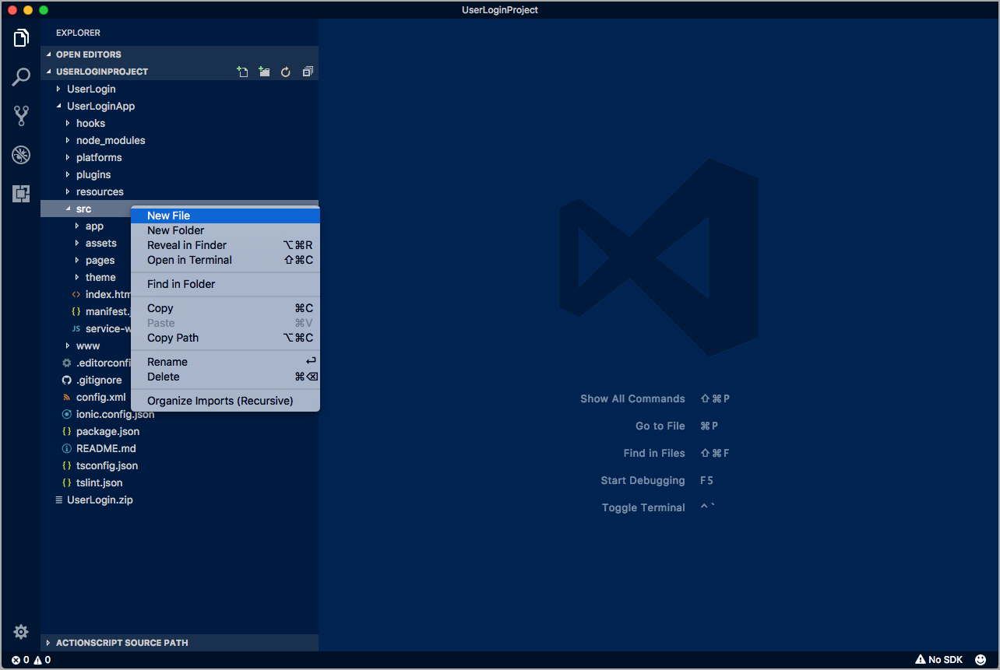

	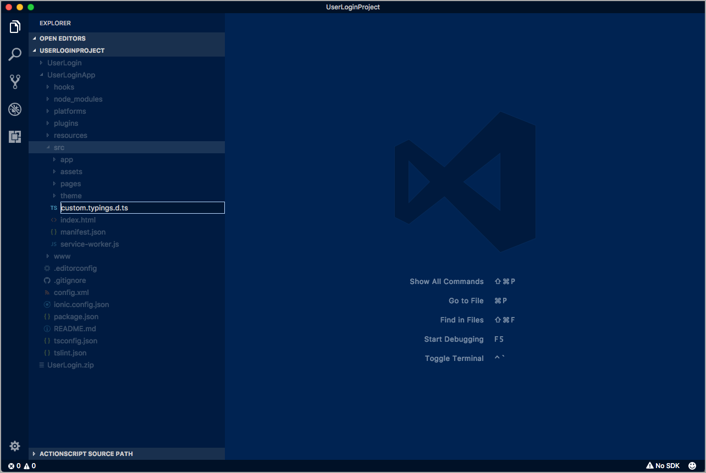

1. Add the following to the newly created file:

	```
	/// <reference path="../plugins/cordova-plugin-mfp/typings/worklight.d.ts" />
	declare module '*';
	```

	This will tell the compiler that the SDK is located in `../plugins/cordova-plugin-mfp/typings/worklight.d.ts` and provide code assist functions of the editor.


1. To create the Login Page, use the Ionic generate command.  Go back to your terminal and ensure that you are in your Ionic Project directory, `~/Projects/UserLoginProject/UserLoginApp`. Then type:

	`ionic g page Login`

	> **NOTE:** To verify that you are in the correct directory you can type the `pwd` command and it will display the current directory. Also note that `~/` is synonymous with your user directory.
		
1. Go back to Visual Studio Code. Navigate to the `UserLoginApp/src/pages` directory and notice that there is now a directory for `login`. In that directory you will have the following:
	
	* `login.html` this is the HTML template for the page
	* `login.module.ts` this is a configuration file that is used to allow for lazy loading of the page.
	* `login.css` this is the style sheet for the page
	* `login.ts` this is the typeScript file for the page or where you would enter your processing logic.


	> **PRO TIP:** If you are using Visual Studio Code, it has an integrated terminal. If you start that you can enter the terminal commands in it and not have to switch back and forth between Visual Studio Code and a terminal window. You can find the Integrated Terminal under the View menu of Visual Studio Code.
	
1. Open the login.html file. For the ion-navbar element, add the attribute color and set it to primary. The code should look as follows:

	```:html
	<ion-header>
	
	  <ion-navbar color="primary">
	    <ion-title>Login</ion-title>
	  </ion-navbar>
	
	</ion-header>
	
	<ion-content padding>
	
	</ion-content>
	```

1. For the content, remove the padding attribute. Next add the following inside the content area:

	```html
	
	
	<form [formGroup]="loginForm" (submit)="login()" novalidate>
		<ion-item>
			<ion-label stacked>Username</ion-label>
			<ion-input formControlName="username" type="text"
				 placeholder="Enter username here"></ion-input>
		</ion-item>
	
		<ion-item>
			<ion-label stacked>Password</ion-label>
			<ion-input formControlName="password" type="password" 
				placeholder="Enter your password"></ion-input>
		</ion-item>
	
		<div padding>
			<button ion-button outline block type="submit">
				Sign In
			</button>
		</div>
	</form>
	<div class="errorBox" 
		[ngClass]="{hidden: !loginError}">
		{{loginError}}
	</div>
	```

1. Save and close.

1. The full source for the login.html file can be found in the scripts directory: [login.html](scripts/login.html.txt)
 
1. Save and close the login.html file. Then open the login.scss file. This is the style sheet for the login page. If you noticed in the code for the image ` In AuthInit()');
		 
		this.AuthHandler = WL.Client.createSecurityCheckChallengeHandler(this.securityCheckName);

		this.AuthHandler.handleChallenge = ((response) => {
			console.log('==> in handleChallenge().', JSON.stringify(response));
			this.loginError = response.errorMsg; 
			this.isChallanged = true;
		});

		this.AuthHandler.handleSuccess = ((response) => {
			console.log('==> in handleSuccess().', JSON.stringify(response));
			this.isChallanged = false;
		});

		this.AuthHandler.handleFailure = ((response) => {
			console.log('==> in handleFailure().', JSON.stringify(response));
			this.isChallanged = true;
		});
	}

	```
	
	The code above first registers a challenge handler for security checks against the `UserLogin` scope. Next it establishes handler methods for when there is a success or a failure.
	
1. Next add the login method. This method will be called when a form submit event is issued by the login.html page. It will first check to see if an attempt to login has been performed already or not and then perform the appropriate call to validate the user's credentials. Enter the following after the constructor method:

	```
	login() {
		console.log('==> Login Page: login(), isChallenged? ', this.isChallanged);
			
		if(!this.isChallanged) {
		  this.loginError = "";
			
		  WLAuthorizationManager.login(
		    this.securityCheckName, 
		    {
		      'username': this.loginForm.value.username, 
		      'password': this.loginForm.value.password
		    }
		  ).then((response) => {
		    console.log("==> LoginPage.login(): Login Success. ", response);
		    this.navCtrl.push(HomePage);
			
		  }, (error) => {
		    console.log("==> LoginPage.login(): Login failed. " + JSON.stringify(error));
		    this.isChallanged = true;
		  });
		 } else {
		  console.log("==> Login ELSE");
		  this.AuthHandler.submitChallengeAnswer({
		      'username': this.loginForm.value.username, 
		      'password': this.loginForm.value.password
		  });
		}
   }

	```
	
1. Next, update the constructor method to build the references to the form elements and to call the `AuthInit()` method. Inside the constructor method type the following:

	```
      console.log('==> Login Page: constructor');

      this.loginForm = formBuilder.group({
        username: ['', Validators.compose([Validators.required])],
        password: ['', Validators.compose([Validators.minLength(3),
        	 Validators.required])]
      });
      // Initialize the authentication handler
      this.AuthInit();
      this.isChallanged = false;
	```
1. Save and close.

1. The full source for the login.ts file can be found in the scripts directory: [login.ts](scripts/login.ts.txt)

1.	Now that the login page has been created, the Application bootstrap needs to be updated to set the default page to the login page instead of the HomePage once the Mobile Foundation runtime startup has completed. Open the `app.component.ts` file found in the `src/app` directory.  

1. Add the following items to the `import` statement for `@angular/core` items; `ViewChild, Renderer`. The line should look like the following:

	```
	import { Component, ViewChild, Renderer } from '@angular/core';
	```

1.	Add `Nav` to the `import` statement for `ionic-angular` items. The line should look like the following:

	```
	import { Platform, Nav } from 'ionic-angular';
	```
1. Remove the `import { HomePage } from '../home/home';` line. This is not needed since the app will load the Login page after Mobile Foundation Runtime starts.

1. Remove the `= HomePage` from the line `rootPage:any = HomePage;`. The line should look like the following:

	```
	rootPage:any;
	```

1. Add a Nav instance variable under the export statement. The line should look like the following:

	```
	@ViewChild(Nav) Nav: Nav;
	```
	
1. Add a `Render` to the parameters of the constructor method. The line should look like the following:

	```
	constructor(
		public platform: Platform, 
		statusBar: StatusBar, 
		splashScreen: SplashScreen,
		public renderer: Renderer) {
	```	

1. Add the following to the body of the constructor.

	```
	renderer.listenGlobal('document', 'mfpjsloaded', () => {
      console.log("==> Mobile Foundation Loaded!");
      this.rootPage = 'login';
    });

	```
	
	What this routine does is set the rootPage to the Login page after the Mobile Foundation runtime has started.
	
1. Save and close.

1. The full source for the login.ts file can be found in the scripts directory: [app.component.ts](scripts/app.component.ts.txt)

1. Open the `config.xml` file found at the root directory.

1. Change the app name from `MyApp` to `UserLoginApp`.

1. Change the description of the app to `Mobile Foundation Login App.`
	
1. Save and close.

## Build and register the application

1. From a terminal, ensure that you are in the `UserLoginApp` directory. You can do that by typing the following:

	```
	pwd
	```
	
	You should be in `[USER DIR]/Projects/UserLoginProject/UserLoginApp`. If you are not in this directory or similar, depending on how you set up your project structure, type the following:
	
	```
	cd ~/Projects/UserLoginProject/UserLoginApp
	```

1.	If the build machine is a Mac and Xcode is installed and configured, build the app using the `ionic cordova build ios` command to build the iOS application.

	> **Note:** if you are not on Ionic 3.7.0 you will be asked to upgrade -> `The Ionic CLI (local version) has an update available (3.6.0 => 3.7.0)`. If you choose to upgrade you will need to re-run the `ionic cordova build ios` command. This will probably ask you to upgrade to the latest cordova plugin for Ionic -> `Local plugin @ionic/cli-plugin-cordova has an update available (1.5.0 => 1.6.2)`. Running this command you will also be asked to upgrade the angular plugin for Ionic. After all that the build will complete.

1. When the build completes you should see `** BUILD SUCCEEDED **`. If not, correct errors and reissue the build command.  What the [`cordova build`](https://cordova.apache.org/docs/en/latest/reference/cordova-cli/#cordova-build-command) command does is transpile your code from ECMAScript 6 to ECMAScript 5 by performing a [`cordova compile`](https://cordova.apache.org/docs/en/latest/reference/cordova-cli/#cordova-compile-command) and then prepares the application as an iOS project using the [`cordova prepare`](https://cordova.apache.org/docs/en/latest/reference/cordova-cli/#cordova-prepare-command).

1. If the build machine has the Android installed and configured, then build the app for Android using the `ionic cordova build android` command.

1. The local version of the Mobile Foundation Server started. Verify that the default server is pointing to localhost:

	```
	mfpdev server info
	```

	The output should be similar to the following with localhost set as the `[Default]`
	
	```
	Name               URL
	-----------------------------------------------------------------------------------
	local              http://localhost:9080                                 [Default]
	-----------------------------------------------------------------------------------
	```

1. Next register the application with the Mobile Foundation Server. Type the following:

	```
	mfpdev app register
	```

	The registration is complete when you see the message saying that the app has been registered for the appropriate platform. Since two platforms were added, Android & iOS, there should be two notifications.  The output of the `mfpdev app register` command should be similar to the following:
	
	```
	Verifying server configuration...
	Registering to server:'http://10.0.1.72:9080' runtime:'mfp'
	Updated config.xml file located at: /Users/KenAtIBM/Projects/	UserLoginProject/UserLoginApp/config.xml
	Run 'cordova prepare' to propagate changes.
	Registered app for platform: android
	Registered app for platform: ios
	```
	
	Notice the line that instructs you to run the `cordova prepare` to propagate changes. This is because a file was downloaded for each platform that contains the information needed for the application to connect to the appropriate Mobile Foundation server and needs to be built into the application.
	
	For iOS this information can be found in `platforms/ios/UserLoginApp/Resources/mfpclient.plist` file. For Android this information can be found in the `platforms/android/assets/mfpclient.properties` file.
	
1. You can perform a `cordova prepare` but since this example is using Ionic, use the `ionic cordova prepare` command. This command is complete when you see the `done` statement as follows:

	```
	> cordova prepare
	✔ Running command - done!
	```

1. Open the server console to see that the application has been register for both iOS and Android. If the server console is already open, then refresh the browser page. Otherwise from a terminal session type `mfpdev server console`.

1. Notice there is now a UserLoginApp application, in fact there are two applications or rather versions of the application, one for the iOS application and one for the Android application.  Expand the UserLoginApp to see the two versions of the application.

	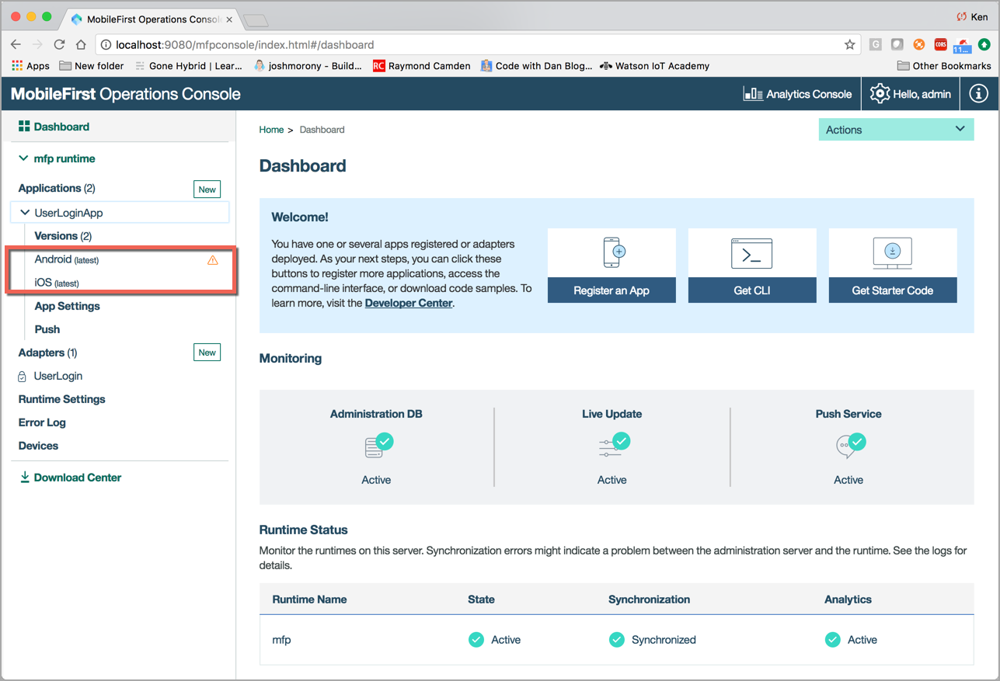
	
1. Select the Android version of the application. Then select the **Security** tab. In the section called **Scope-Elements Mapping**, **Click** the **New** button.

	
	
1. When the **Add New Scope-Element Mapping** dialog window opens, enter `UserLoginScope` for the **Scope Element** and **Click** the **UserLogin** button in the **Custom Security Checks**. When the screen looks like below, **Click** the **Add** button to create the new Scope-Element Mapping.

	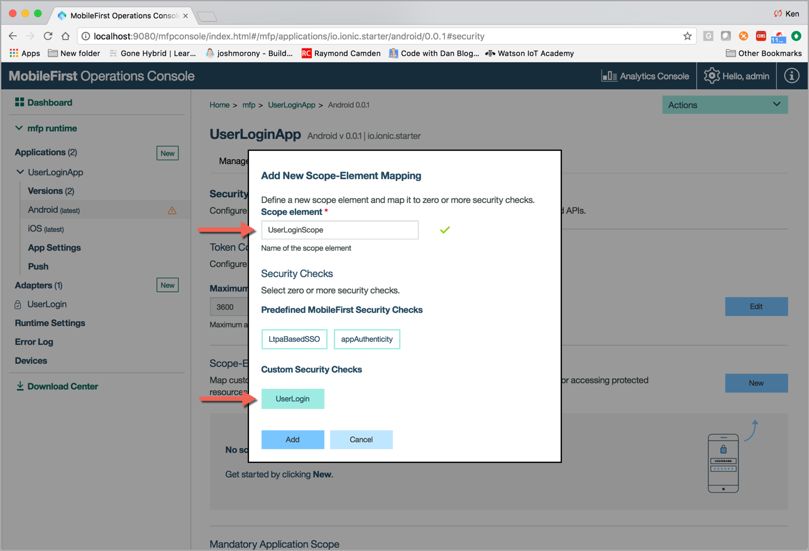
	
1. Notice that the mapping is now complete. There is a Scope Element of UserLoginScope that maps to the UserLogin security check. The UserLogin Security Check was created when the UserLogin Adapter was published to the server.

	
	
1. Repeat this process for the iOS version of the application. When complete the **Security** tab of the iOS version of the application should look like the following:

	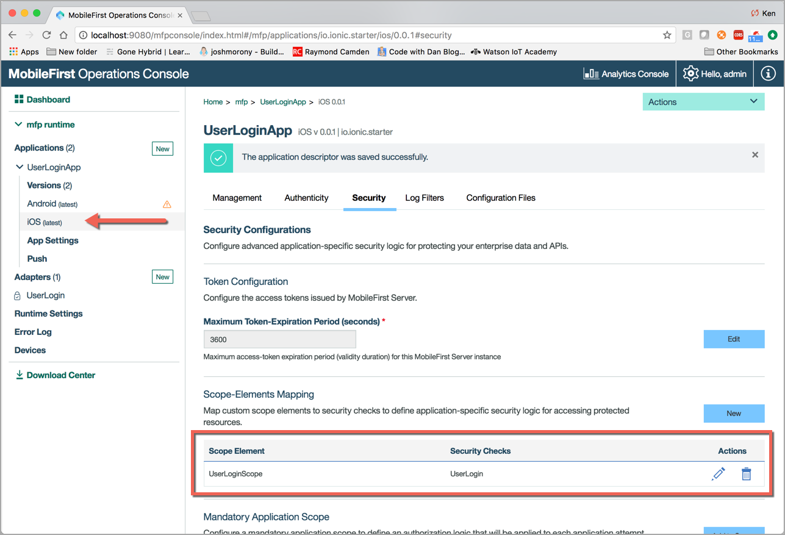
	
1. Now that the applications have been built, registered, and the security scope has been mapped, you are ready for testing.

## Test using iOS

You will need an Apple Developer ID to test using the iOS simulator. You should not need to pay for a Developer subscription unless you want to deploy apps to a physical device.

1. Open the application in Xcode. For the application root directory in a terminal screen type:

	```
	open platforms/ios/UserLoginApp.xcworkspace
	```
	 
1. Once Xcode has started and any processing has competed, you will need to turn on Keychain Sharing (this is why you need an Apple developer id). On the left toolbar, find the **folder icon** - this is known as the **Project Navigator**. **Select** the **UserLoginApp**, this will display a list of configuration options. **Select** the **Capabilities** tab and scroll to **Keychain Sharing**.

	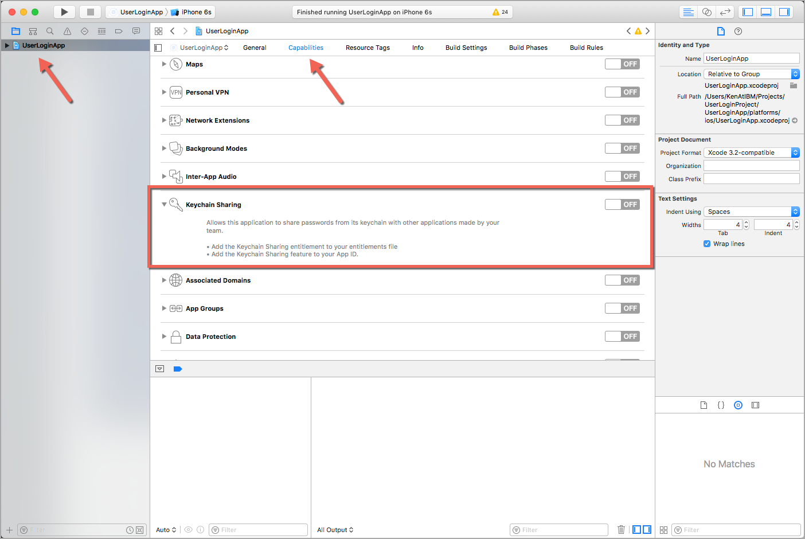
	
1. **Click** the switch to enable Keychain Sharing. This will open a dialog for you to select your development team, in most cases just a user.

	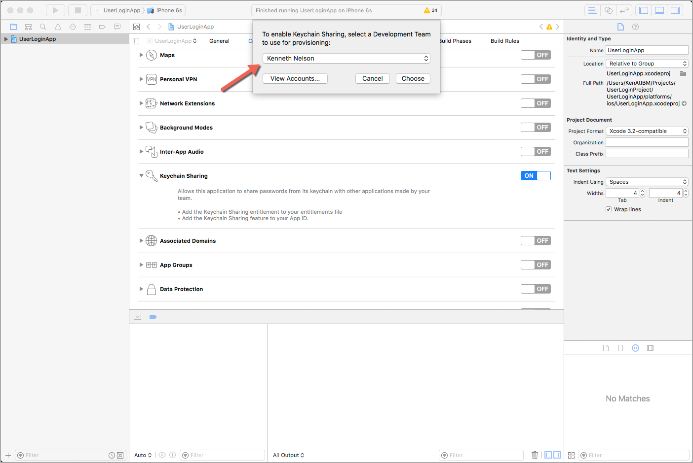
	
	**Select** your team and **Click** the **Choose** button.

1. When done, your Keychain Sharing should look as follows:

	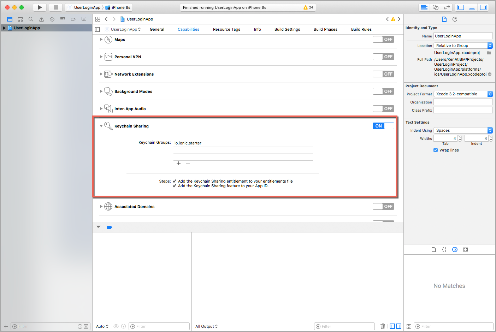 


1. Next select a simulation device and **Click** the **Play** button.

	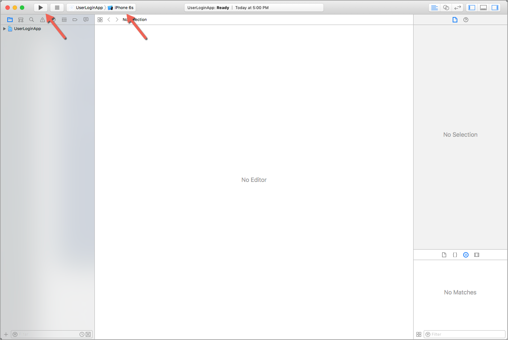
	
1. This will start the simulator and run the appication.

	

1. The UserLogin adapter requires that you simply enter the same value for the user name and password. The application also requires that the password be at least 3 characters (when you created the login page a validator was set with a minimum length of the password field of 3).  Enter a username such as `ken` and enter an invalid password such as `qqq` and **Click** the **Sign In** button.

	> **NOTE:** To force a lower case ken, hit the left shift key twice and then the 'k', this will force the keyboard to lowercase. If you have a situation where the keyboard is not displaying, use the **Hardware** menu and select **Keyboard** then **Toggle Software Keyboard**.

	
	
	Notice that we get an error message stating **Wrong Credentials**

1. Fix the password by typing in `ken` for the password so it matches the username and **Click** the **Sign In** button. This time validation should be successful and you should see the Home Page.

	
	
## Test using Android

> **NOTE:** If you have Docker running you will need to stop it, otherwise the Android emulator will not start. See [Fix for the Android Emulator crashing during launch](https://www.bram.us/2017/05/12/fix-for-the-android-emulator-crashing-during-launch/) for more information.

1. Start Android Studio

1. Select 'Open an existing Android Studio project'

	

1. Navigate to the `Projects/UserLoginProject/UserLoginApp/platforms/android` and **Click** the **OK** button.

	

1. Ensure that you have an emulator Android Virtual Device (AVD) defined by **Clicking** the **AVD Manager** button. If you do not have a AVD define, **Click** the **Create Virtual Device** button and follow the wizard.

	

	

1.	Once there is a valid AVD, start the emulator by **Clicking** the **Launch this AVD in the emulator** button.

	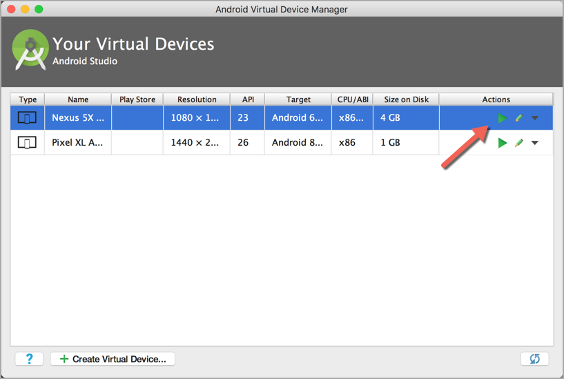

1. With a AVD started, **Click** the **Run 'android'** button. This will build the app and start the emulator if not already started.

	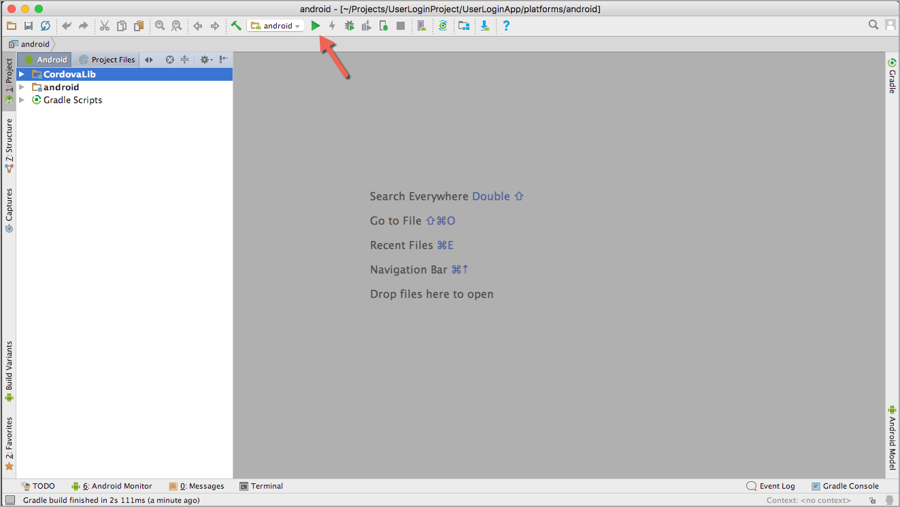
		
1. A dialog will display to select the appropriate deployment target. **Select** a connected device, in this example the connected device is the Nexus 5X API 23, and **Click** the **OK** button. 

	

1. The app (apk) will be pushed and started on the connected device. 

	

1. The UserLogin adapter requires that you simply enter the same value for the user name and password. The application also requires that the password be at least 3 characters (when you created the login page a validator was set with a minimum length of the password field of 3).  Enter a username such as `ken` and enter an invalid password such as `qqq` and **Click** the **Sign In** button.

	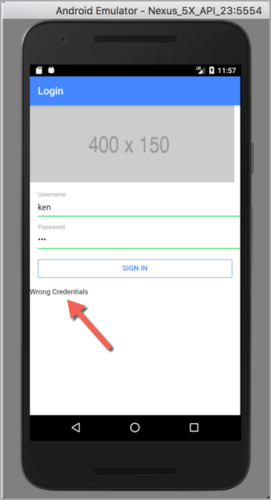

Notice that we get an error message stating **Wrong Credentials**

1. Fix the password by typing in `ken` for the password so it matches the username and **Click** the **Sign In** button. This time validation should be successful and you should see the Home Page.

	
	
## Conclusion

This completes this User Login tutorial. In this tutorial you: 
* Used a sample Security Check adapter to provide user authentication for an app. 
* Development an Ionic Login Application
* Deployed a hybrid app for iOS and Android
* Tested the Login App on iOS and Android

